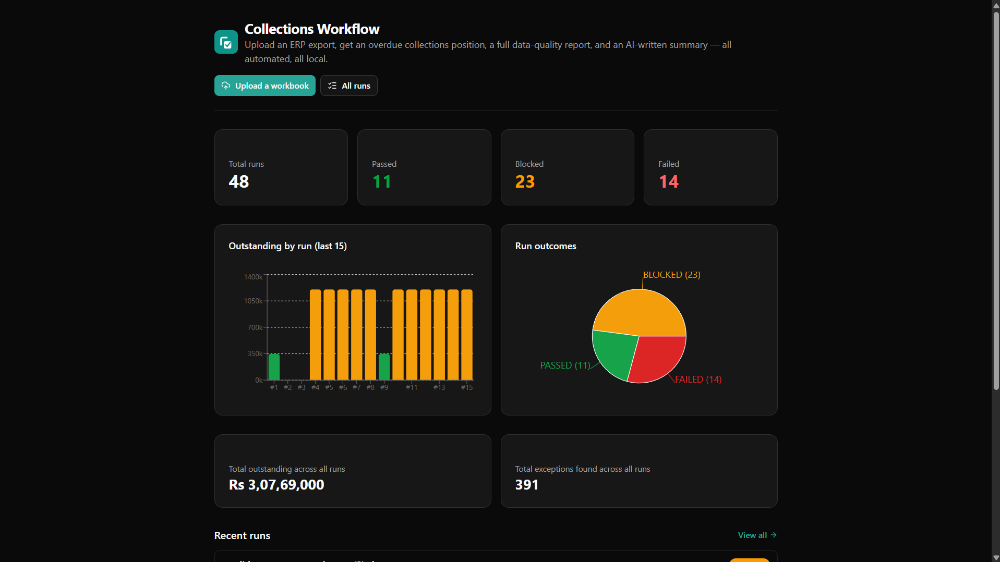
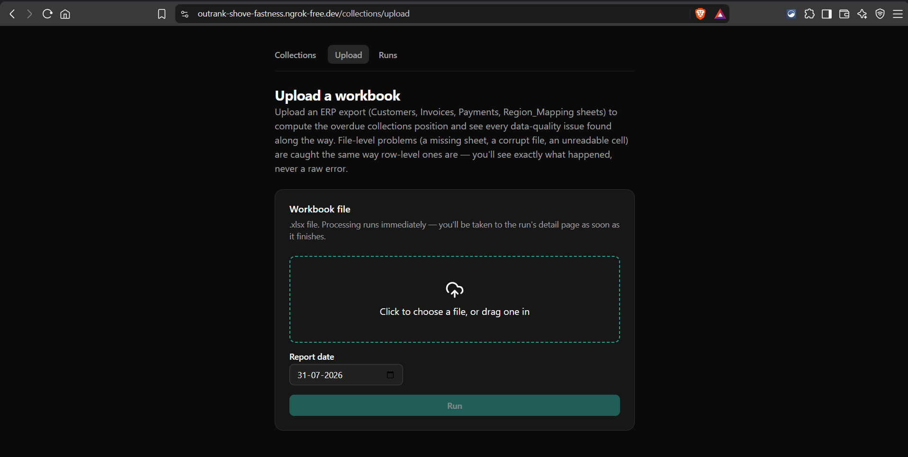
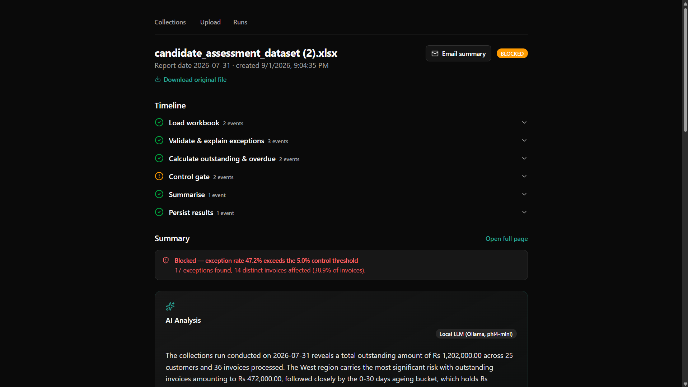
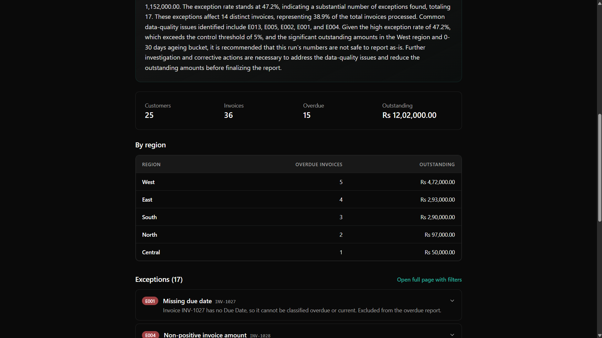
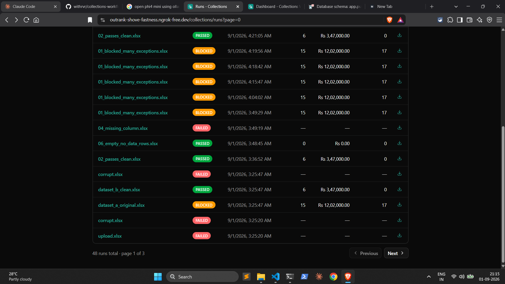
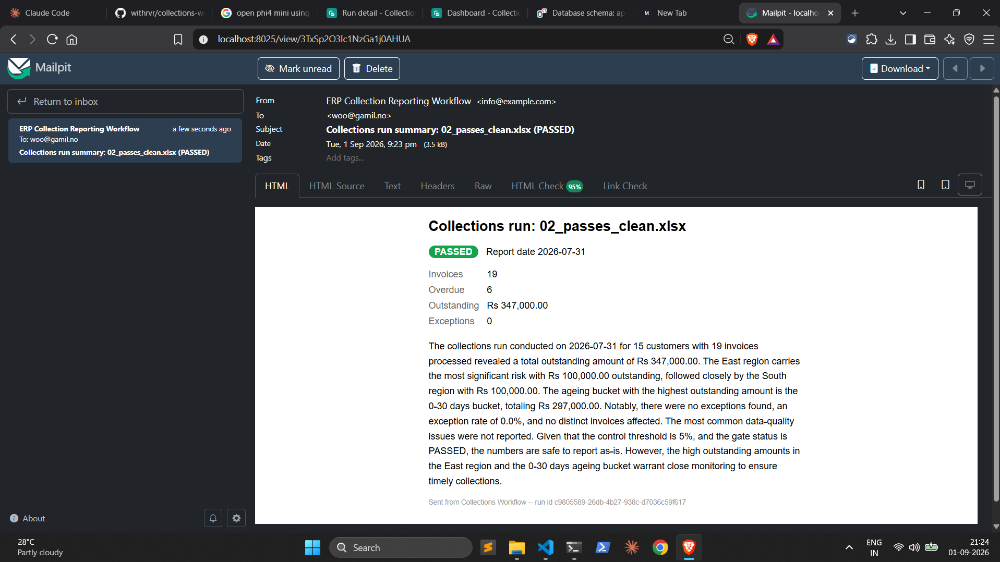
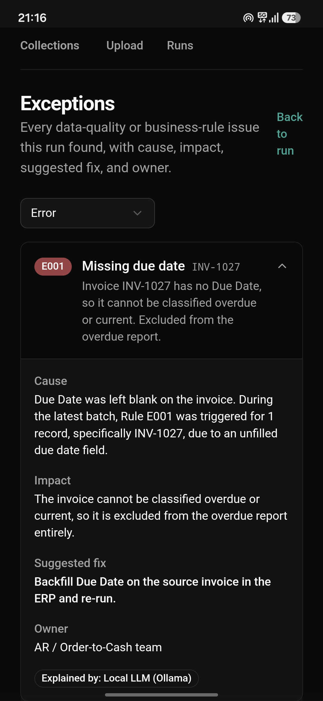
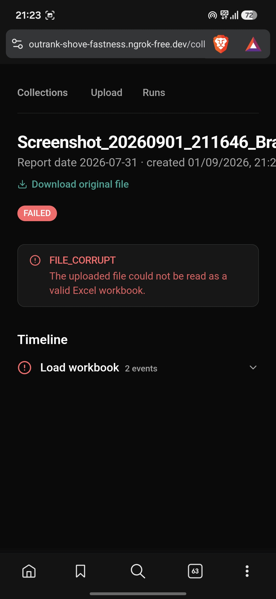
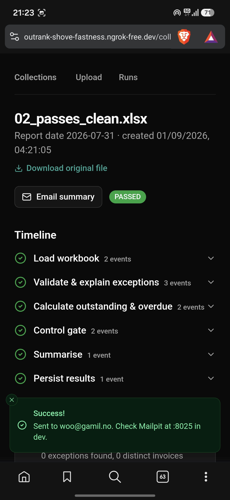

# Collections Workflow

An ERP collection reporting service: upload a workbook (Customers,
Invoices, Payments, Region_Mapping), get back an overdue collections
position — invoice-level and by region/customer — plus a full data
quality/exception report, with nothing silently dropped along the way.

Backend: FastAPI + SQLModel + Postgres. Frontend: React + TanStack
Router. Docker Compose for local dev.

## Screenshots

**Dashboard** — run totals, outcome/outstanding charts, recent runs, one click into upload or history.



**Upload** — drag-and-drop a workbook, pick a report date, run.



**Run detail** — timeline, control-gate status, and an AI-written analysis (region, ageing, and top exception rules called out, not just totals).



**Run detail (continued)** — region breakdown and the exception list, each with its own cause/impact/fix.



**Runs list** — every upload, paginated, with a one-click download of the original file.



**Email summary** — send a run's result to any address; caught by Mailpit in dev.



**Mobile — exception detail** — cause, impact, suggested fix, and owner, fully readable on a phone.



**Mobile — failed run** — a corrupt upload fails cleanly with a readable reason, never a raw error.



**Mobile — passed run** — a clean run, its email sent, right from the phone.



**This file is deliberately short and stable.** It exists to orient
anyone landing on the repo and point them to the real documentation —
it does not track phase-by-phase progress itself (that's
[`docs/CHANGELOG.md`](docs/CHANGELOG.md) and
[`backend/app/collections/README.md`](backend/app/collections/README.md)'s
own status line).

## Start here

| I want to... | Go to |
|---|---|
| Understand what the service does, its business rules, assumptions, and what's been validated | [`backend/app/collections/README.md`](backend/app/collections/README.md) — **the actual source of truth for this project** |
| See the full design and phase-by-phase build plan | [`MASTER_PLAN.md`](MASTER_PLAN.md) |
| See what's shipped, phase by phase | [`docs/CHANGELOG.md`](docs/CHANGELOG.md) |
| Read the exception rule catalogue (E001-E014) | [`backend/app/collections/docs/RULES.md`](backend/app/collections/docs/RULES.md) |
| Read the architecture and design decisions | [`backend/app/collections/docs/ARCHITECTURE.md`](backend/app/collections/docs/ARCHITECTURE.md) |
| Read the API reference | [`backend/app/collections/docs/API.md`](backend/app/collections/docs/API.md) |
| Test every endpoint without writing code | [`postman/`](postman/) — import collection + environment, run |
| Set up local development, run tests, understand the git workflow | [`backend/app/collections/docs/DEVELOPMENT.md`](backend/app/collections/docs/DEVELOPMENT.md), [`development.md`](development.md) |
| Deploy the stack | [`deployment.md`](deployment.md), [`deployment-docker-compose.md`](deployment-docker-compose.md) |
| Follow the standing build instructions this project's development follows | [`AGENTS.md`](AGENTS.md) |

## Quickstart

```bash
# Backend, native (no Docker needed for tests/scripts)
cd backend
uv sync
uv run pytest app/collections/tests -v                        # 168 tests
uv run python -m app.collections.scripts.reference_summary    # reference numbers

# Full stack (Postgres, backend, frontend, Traefik, Adminer, Mailpit)
docker compose watch
curl http://localhost:8000/api/v1/utils/health-check/         # -> true
```

Swagger UI: http://localhost:8000/docs. See
[`backend/app/collections/docs/DEVELOPMENT.md`](backend/app/collections/docs/DEVELOPMENT.md)
for the full command reference.

## Repo layout

```
backend/app/collections/     the entire assessment service — one folder,
                              one concern, see MASTER_PLAN.md section 4
frontend/src/routes/collections/   the assessment UI
docs/CHANGELOG.md            this project's own history
MASTER_PLAN.md               design and phase-by-phase build plan
QA_PREP.md                   companion doc: the questions MASTER_PLAN.md answers
```

## License

MIT — see [`LICENSE`](LICENSE). Built on `fastapi/full-stack-fastapi-template`
(MIT, © Sebastián Ramírez); this project's own work is © its author,
under the same license.
