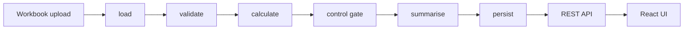

# ERP Collection Reporting Workflow

An ERP collection reporting service built on
`fastapi/full-stack-fastapi-template`. This file is the single source
of truth for **what the service does, why it is built this way, and
how to run it**. Everything else — internals, endpoints, the rule
catalogue, local setup — is owned by one other file each; see the map
at the bottom rather than this file repeating them.

Status: **core scope (Phases 0-8) complete**, plus several extended-scope
extras (file download, email, dashboard, full rebrand) already pulled
forward. See
[`../../../docs/CHANGELOG.md`](../../../docs/CHANGELOG.md) for the
exact, dated history of what shipped when.

## The one-paragraph version

Upload an ERP export (Customers, Invoices, Payments, Region_Mapping),
get back an overdue collections position — by invoice, by customer, by
region — as of a fixed report date, plus a full data-quality report
that explains every row it had to exclude rather than silently dropping
it. A control gate blocks the management summary outright if more than
5% of invoices carry a data-quality exception, so nobody reads a clean
number that was quietly computed from dirty data. A local LLM narrates
the result in plain English and explains each exception in business
terms — but it never computes a rupee figure; every number in this
system comes from typed Python arithmetic, and the model's output is
mechanically checked against that arithmetic before it's shown to
anyone.

## Why it's built this way

Three constraints drove every decision here, and they're worth stating
up front because they explain choices that would otherwise look
arbitrary:

1. **The numbers must be provably correct, not just plausible.**
   Financial figures come from typed `Decimal` arithmetic in plain
   Python functions — never from an LLM, never from a DataFrame's
   inferred dtype, never from parsing formatted text. This is why the
   AI layer only ever *narrates* and *explains* a dictionary of
   already-computed numbers, why a post-generation guard rejects any
   model output that invents a figure, and why there's a test that
   independently recomputes the headline numbers straight out of
   Postgres with raw SQL and checks they still agree.
2. **A bad row is a fact to report, not a problem to hide.** Nothing is
   ever silently dropped. Every invoice or payment excluded from a
   calculation carries an exception row explaining why, in a fixed
   14-rule catalogue, with a suggested fix and an owning team. A run
   that hits too many of these blocks automatically rather than
   producing a falsely-clean summary.
3. **This is a fifteen-minute review, not a platform.** Every design
   choice was checked against "can a reviewer see, click, and
   understand this quickly" — which is why there's a real (if
   deliberately unauthenticated) UI on top of the API, why failures
   read in plain English instead of a stack trace, and why the AI
   narrative reads like an analyst's note instead of a one-line status
   message.

## How it works — the flow



Six stages, run in a fixed order by one plain Python function
(`service.execute_run`) — deliberately **not** an autonomous agent, so
the same input always produces the same output and every step can be
proven correct in isolation:

| Stage | What happens |
|---|---|
| **load** | The workbook is read with `openpyxl` straight into typed (`Decimal`/`date`) records — no pandas, no DataFrame, so there's no second, looser numeric-parsing path anywhere in the system |
| **validate** | All 14 exception rules run against the typed records; every excluded row gets a rule code, a plain-English message, a cause, an impact, a suggested fix, and an owner |
| **calculate** | Outstanding, overdue, ageing, and region figures are computed by pure functions over the already-validated data |
| **control gate** | The exception rate is checked against a 5% threshold. Over it, the run is `BLOCKED` — the summary still shows the numbers, but flagged, not presented as clean |
| **summarise** | A local LLM turns the frozen numbers into a plain-English narrative — or, if it's unavailable, a deterministic template does the same job with no model at all |
| **persist** | Every stage's outcome — the run, its timeline, its exceptions, its invoice positions — is written to Postgres, so nothing lives only in a log file |

A run is *always* a real, queryable database row with a status of
`PASSED`, `BLOCKED`, or `FAILED` — the pipeline function never raises,
so a bad upload can never turn into an unhandled `500` and a blank
screen. See `docs/ARCHITECTURE.md`'s "Data flow" and "The error
contract" sections for the mechanics behind that guarantee.

On top of the pipeline: six REST endpoints (`docs/API.md`) and a
five-page React UI (below) that together let a reviewer with no
terminal access drive the entire flow — upload, read the timeline, read
the exceptions, read the summary — from a browser.

## Business logic

- Report date is fixed at `2026-07-31` (`config.py`), sourced from the
  workbook's own README sheet, never `datetime.now()` — a collection
  position has to be reproducible from the same file on any day it's
  re-run.
- Only `Approved` invoices count toward the overdue report;
  `Cancelled` and `Credit Note` invoices are excluded from it but still
  shown in the exception report, never silently dropped.
- Outstanding = Invoice Amount − valid payments received on or before
  the report date. Tax is carried through for reference, never added.
- A payment is valid only if it's positive, dated on or before the
  report date, and its customer matches the invoice's own customer —
  a payment that fails any of those is excluded and flagged, not
  quietly applied anyway.
- Overdue = Due Date strictly before the report date **and**
  Outstanding > 0.
- A blank Customer Region is derived from `Region_Mapping` via State,
  never left blank in the output.
- **The control gate**: exception rows ÷ invoice count. Over 5%, the
  run is `BLOCKED`; at or under, it `PASSED`. The gate is never tuned
  to pass — the given sample file blocks at 47.2%, and that's the
  correct output for that file, not a bug to chase away.

The full 14-rule exception catalogue — every condition, every dataset
example, every rationale — lives in
[`docs/RULES.md`](docs/RULES.md); a handful of documented judgement
calls (how the gate's denominator was resolved, why an early payment
still counts in full, ageing bucket boundaries) live in **Assumptions**
below. Both are deliberately kept out of this section so this file
doesn't drift out of sync with the single source of truth for either.

## Assumptions

- **A payment dated before its own invoice's invoice date still counts
  in full toward outstanding.** The workbook lists "payment before
  invoice" only as an exception-report item, not a reason to exclude
  the payment — verified against the given dataset, since the reference
  figures below only reconcile under this reading.
- **Ageing bucket boundaries (0-30 / 31-60 / 61-90 / 90+ days)** are a
  standard-practice default, not specified in the workbook.
- **The control gate's denominator is the exception-*row* count over
  invoice count**, not distinct invoices affected — the brief's own
  wording is ambiguous here (see `docs/ARCHITECTURE.md`'s control gate
  section for the full reasoning), so both rates are computed and both
  are returned by `GET /collections/summary`, not just the one that
  drives the gate.
- Netting an overpaid invoice (E014) against a customer's other open
  balances, or netting a Credit Note against open invoices, are both
  business decisions the workbook doesn't define — surfaced as
  exceptions rather than assumed.

Reference numbers, for a quick sanity check against the given file: 25
customers, 36 invoices, 29 payments — 15 overdue invoices totaling
**₹12,02,000**, West the heaviest region (₹4,72,000), 17 exception rows
(47.2% of invoices — blocks the gate).

## Validation and proof of correctness

"We tested it" is not an answer a reviewer can act on; here's the actual
evidence, in order of how convincing it is:

- **A coverage test asserts all 14 rules fire on the given dataset**, so
  a rule that silently stops triggering is treated as a bug, not good
  news — this is different from just checking "no crash."
- **A reconciliation test proves no rupee is created or destroyed**:
  every invoice's outstanding + valid-paid amount equals its original
  invoice amount plus any overpayment, summed across the full 36-invoice
  portfolio — an internal-consistency identity, not just a spot check.
- **An independent SQL recompute** — the strongest evidence in the
  suite. The headline figures (15 overdue, ₹12,02,000, West heaviest)
  are computed twice, by two genuinely different code paths: once by the
  in-memory Python calculator, and once by a raw SQL `SUM`/`GROUP BY`
  over what actually landed in Postgres. Agreement between the two is
  real proof the persistence layer isn't silently dropping or
  double-counting a row, not the same arithmetic checked against itself.
- **Every rule test asserts the exact set of IDs it should fire on**,
  not just "fired at least once" — a rule quietly over- or under-firing
  is caught the same way a fully silent one would be.
- **Five deliberately broken workbooks** (missing sheet, missing column,
  corrupt file, an unparseable cell, an empty sheet) each assert a
  specific error code and a plain-English message with no `"Traceback"`
  or raw exception text anywhere in it — the error contract is tested
  against the literal user-facing string, not just "some error happened."
- Against a **real, unmocked local Ollama model** (not a mocked stub):
  the narrator produces a narrative and never surfaces an invented
  number; the explainer never cites a record ID outside the exact batch
  it was given.

168 tests total. The full breakdown by phase, and the exact commands to
run any of it, live in `docs/DEVELOPMENT.md`'s "Commands" and "Testing"
sections — this section is the *evidence*, that one is the *mechanics*.

## How the AI is actually used

The short version a hiring reader can act on: **the model never
touches a number.** It writes prose about numbers someone else already
computed, and everything it writes is mechanically checked before it's
shown to anyone. The longer version, because "we used AI" means
nothing without the guardrails:

**One provider seam, two roles, three-rung fallback.** A single
LiteLLM integration (`ai/provider.py`) talks to a local Ollama model
(`phi4-mini`, the default and the only rung exercised without extra
setup) and, only if explicitly configured, an optional cloud model —
never required, off by default, and this project runs and was
demonstrated end to end with the network disconnected. Two independent
roles sit on top of that one seam:

- **`summary_narrator`** writes the run's management summary — the
  plain-English paragraph a non-technical reader sees first: what ran,
  what's overdue, which region is heaviest, how many exceptions, and
  whether the gate passed or blocked.
- **`exception_explainer`** writes the cause/impact/suggested-fix/owner
  behind every exception rule that fired — batched once per rule code,
  not once per row, because "why did rule E001 fire" has exactly one
  answer no matter how many invoices it hit.

If the local model is unreachable, an optional cloud model is tried
next (when configured); if that's also unavailable, a deterministic
Jinja template produces the same shape of output with no model
involved at all. **Every run records which of the three actually
produced its text** (`summary_source` / `explanation_source`:
`"ollama"` / `"cloud"` / `"fallback"`) and shows it in the UI as a
badge — never presented as if a model wrote it when it didn't.

**Why the model can't invent a number.** Both roles' prompts contain
only a frozen dictionary of already-computed figures — never the raw
workbook. Every output, from every rung, is run through a
post-generation guard (`ai/guard.py`) before it's accepted: one check
extracts every numeric token the model wrote and rejects the output
outright if any of them wasn't in the input it was given; a second does
the same for record IDs, so an exception explanation can't cite an
invoice or customer it was never shown. A rejected output isn't shown
half-broken — the chain just falls through to the next rung. This is
the mechanism that turns "the LLM only narrates" from a rule someone
followed into something enforced in code.

**anydoc — why it's in the stack even though no live role calls it
yet.** `ai/context.py` converts a workbook straight to compact Markdown
for LLM context, in single-digit milliseconds, with no external
service. The point of it is **token efficiency and reliability for a
small local model**: sending a workbook's structure as compact Markdown
instead of raw JSON keeps a prompt small enough for a 4B-parameter
model to handle its context window reliably, instead of truncating or
losing structure on a large, verbose payload. It's wired and tested
today, reserved for the schema-mapping role that reads a *renamed*
workbook (extended scope, not yet part of the core build) — being
honest about that is more useful to a reviewer than overstating what's
active. What's non-negotiable either way is the boundary it's built
under and never crosses:

```
ALLOWED   workbook -> anydoc -> markdown -> LLM context
BANNED    workbook -> anydoc -> markdown -> parse -> financial calculation
```

A Markdown table cell is a formatted string that has already lost
precision and type — every number in this system comes from `openpyxl`
reading a typed cell directly, never from parsing rendered text, and
anydoc's output is never allowed anywhere near that path.

Full mechanics — the exact guard functions, the caching strategy, the
Docker/Ollama networking setup — are `docs/ARCHITECTURE.md`'s job, in
"The LLM layer" and "The anydoc boundary" sections; this section is the
"why," that one is the "how."

## The UI — built so a non-technical reviewer needs nothing else

Five routes, no login (this is an internal ops tool, not a multi-tenant
product — the API behind it has no auth either, deliberately):

| Route | What it's for |
|---|---|
| `/collections/upload` | Drag a workbook onto the page (native HTML5 drag-and-drop) or click to browse, run it, land straight on the result |
| `/collections/run-detail?runId=` | **The one-screen view.** A colored stage timeline — green through a healthy stage, amber where the gate blocks, red on failure — expandable per stage down to the exact event; then, inline with no further clicks, the block/pass banner, the AI narrative with its source badge, the region breakdown, and the first 10 exceptions with cause/impact/fix/owner expandable per row |
| `/collections/exceptions?runId=` | The full exception list, filterable by rule and severity, for deep-diving past the run-detail preview |
| `/collections/summary?runId=` | The same summary content alone, for sharing a direct link to just the numbers |
| `/collections/runs` | Every run so far, paginated, with a download link for the original upload |

**Step-by-step failure visibility is the point of the timeline, not an
afterthought.** A `FAILED` run doesn't produce a blank error page — it
lands on the exact same run-detail view, with the exact stage that
failed shown in red and a plain-English reason (never a raw traceback;
see `docs/ARCHITECTURE.md`'s error contract) attached to it. Someone
with no server access can answer "what happened to my file, and at
which step" unaided, straight from the browser.

Built entirely on the template's own shadcn/ui components — no new UI
library — and verified manually end to end in a real browser against
the Docker-served app: upload, land on a `BLOCKED` run-detail page,
expand a timeline stage, click through to exceptions and summary, zero
console errors throughout.

## Screenshots

Walkthrough screenshots — the dashboard, upload, the run-detail timeline
with its AI-written analysis, the exceptions list, and the mobile views —
live in the [root README](../../../README.md#screenshots).

## Technology used

| Layer | Choice | Why |
|---|---|---|
| API framework | FastAPI (unmodified `fastapi/full-stack-fastapi-template` base) | Supplies everything outside this project's own scope — Postgres/SQLModel/Alembic, Docker Compose, CI, a React frontend — so every commit on top of the init commit is this project's own work, and the diff is the deliverable |
| Data model | SQLModel + Alembic | One ORM layer for both the Pydantic-style models and the SQL schema, with real migrations |
| Money/dates | `Decimal` / `date`, never `float`/`datetime.now()` | Financial figures can't tolerate binary floating-point rounding, and a report date has to be reproducible, not clock-dependent |
| Workbook parsing | `openpyxl` (no pandas) | Typed cell access straight into typed records — no second, looser dtype-inference path for money to travel through |
| LLM runtime | Ollama (local, `phi4-mini`) via LiteLLM | Keeps financial data on the machine by default; LiteLLM makes the cloud fallback a one-env-var swap, not a rewrite |
| Context conversion | anydoc (`firecrawl-anydoc`) | Compact Markdown for LLM prompts only — see "How the AI is actually used" above |
| Frontend | React + TanStack Router + shadcn/ui | The template's own stack; no new UI dependency added anywhere in this project |
| Testing | pytest, 168 tests | Unit, boundary, reconciliation, SQL-crosscheck, API, and real (unmocked) LLM tests — see `docs/DEVELOPMENT.md` |
| Quality gates | ruff, mypy, ty, biome, pre-commit | Enforced on every commit — see `docs/DEVELOPMENT.md`'s "Quality gates and agent-assisted development" |

## Documentation map

Each fact here lives in exactly one file; everything else links to it
rather than repeating it:

| File | Read it for |
|---|---|
| **README.md** (this file) | What it does, why it's built this way, business rules, assumptions, the AI design, the UI |
| [`docs/ARCHITECTURE.md`](docs/ARCHITECTURE.md) | Every component, the data flow, the *how* behind every decision above, trade-offs, what changes at production scale |
| [`docs/API.md`](docs/API.md) | Every endpoint — method, path, params, response schema, error codes |
| [`docs/RULES.md`](docs/RULES.md) | The exception rule catalogue, E001-E014, one entry each |
| [`docs/DEVELOPMENT.md`](docs/DEVELOPMENT.md) | Local setup, every test/lint command, git workflow, and how this codebase was actually built with agent tooling |
| [`docs/DEMO.md`](docs/DEMO.md) | The live presentation runbook |
| [`../../../docs/CHANGELOG.md`](../../../docs/CHANGELOG.md) | The dated, phase-by-phase history of everything that shipped |
| [`../../../QA_PREP.md`](../../../QA_PREP.md) | Twenty design-rationale questions and answers, grounded in this exact codebase |
| [`../../../MASTER_PLAN.md`](../../../MASTER_PLAN.md) | The original design and phase plan this build followed |
